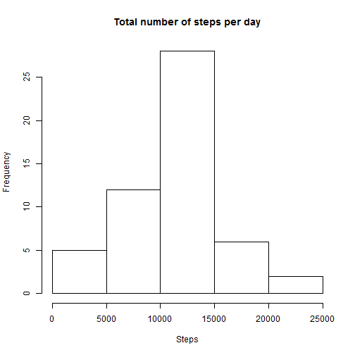
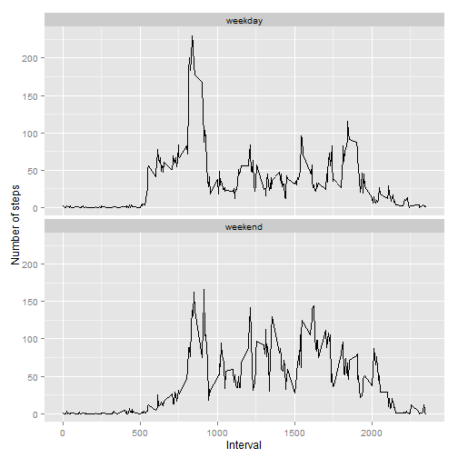

##Loading and preprocessing data


```r
setwd('C:\\R\\Reproduciable Research\\PA1')

data = read.csv("activity.csv", header = TRUE)
```

##What is mean total number of steps taken per day?

### Creating a data frame with total number of steps taken per day

```r
library(plyr)

totalsteps = ddply(data, .(date), summarize, sumsteps = sum(steps))
```

### Making a histogram

```r
hist(totalsteps$sumsteps, main="Total number of steps per day", 
     xlab="Steps")
```

 

### Mean of the total number of steps taken per day

```r
mean(totalsteps$sumsteps, na.rm = TRUE)
```

```
## [1] 10766.19
```

###Median of the total number of steps taken per day

```r
median(totalsteps$sumsteps, na.rm = TRUE)
```

```
## [1] 10765
```

## What is the average daily activity pattern?

### Time series plot

```r
meanintsteps = aggregate(steps ~ interval, data, mean)

plot(meanintsteps$interval, meanintsteps$steps, type = "l", xlab="Interval", ylab = "Steps")
```

 


### 5-minute interval with the maximum average number of steps


```r
rowid <- which.max(meanintsteps$steps)
meanintsteps[rowid,]
```

```
##     interval    steps
## 104      835 206.1698
```

## Imputing missing values

### Total number of missing values in the dataset


```r
length(which(is.na(data$steps)))
```

```
## [1] 2304
```

### Filling in all of the missing values in the dataset with mean value for the specific 5-minute interval


```r
n <- nrow(data)
datanonan <- data

for (i in 1:n){
  if (is.na(datanonan$steps[i])){
    int <- datanonan$interval[i]
    row_id <- which(meanintsteps$interval == int)
    datanonan$steps[i] <- meanintsteps$steps[row_id]
  }
}


totalstepsnonan = ddply(datanonan, .(date), summarize, sumsteps = sum(steps))

hist(totalsteps$sumsteps,  main="Total number of steps per day", xlab="Steps")
```

 

### Mean of the total number of steps taken per day

```r
mean(totalstepsnonan$sumsteps, na.rm = TRUE)
```

```
## [1] 10766.19
```

###Median of the total number of steps taken per day

```r
median(totalstepsnonan$sumsteps, na.rm = TRUE)
```

```
## [1] 10766.19
```

## Are there differences in activity patterns between weekdays and weekends?

### Creating a new factor variable ("weekday") in the dataset indicating day type 


```r
datanonan$date <- as.Date(datanonan$date, "%Y-%m-%d")
datanonan$day <- weekdays(datanonan$date)
datanonan$day_type <- c("weekday")

for (i in 1:n){
  if (datanonan$day[i] == "Saturday" || datanonan$day[i] == "Sunday"){
    datanonan$day_type[i] <- "weekend"
  }
}

datanonan$day_type <- as.factor(datanonan$day_type)

meanintstepsnonan <- aggregate(steps ~ interval+day_type, datanonan, mean)
```

### Making a time-series plot 


```r
library(ggplot2)
qplot(interval, steps, data=meanintstepsnonan, geom=c("line"), xlab="Interval", 
     ylab="Number of steps") + facet_wrap(~ day_type, ncol=1)
```

 
